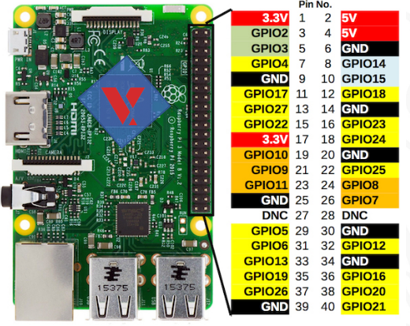

# GPIOLib documentation #

The library consists of a struct, 6 macros and 4 functions:
* Struct:
  * ***gpioSetStruct***: it couple a pin number and a value. It's the only required interface for setting and using the GPIO pins;
* Macros:
  * ***PINMODE_OUT***: it's the value to set a pin to output mode;
  * ***PINMODE_IN***: it's the value to set a pin to input mode;
  * ***OUTMODE_HIGH***: it's the value to set an output pin to high tension value;
  * ***OUTMODE_LOW***: it's the value to set an output pin to low tension value;
  * ***INMODE_HIGH***: it's the value setted for an input pin at high tension value;
  * ***INMODE_LOW***: it's the value setted for an input pin at low tension value;
* Functions: they are simply wrappers for vxbGpioLib's functions, but easier to use
  * ***gpioSetVal(gpioSetType * gSet)***: it's the function to set an output pin to a value;
  * ***gpioGetVal(gpioSetType * gSet)***: it's the function to get an input pin's value;
  * ***gpioSetDir(gpioSetType * gSet)***: it's the function to set a pin to input or output mode;
  * ***gpioGetDir(gpioSetType * gSet)***: it's the function to get a pin's mode;

## Pinout Scheme ##
<p align=center>
    
</p>

## How to ##
### "Write" to a pin ###
```c
struct gpioSetStruct gpioPin;
gpioPin.gpioNum = *GPIO number*;
gpioPin.val = PINMODE_OUT;
gpioSetDir(&gpioPin);
gpioPin.val = OUTMODE_HIGH/OUTMODE_LOW;
gpioSetVal(&gpioPin);
```
### "Read" a pin ###
```c
struct gpioSetStruct gpioPin;
gpioPin.gpioNum = *GPIO number*;
gpioPin.val = PINMODE_IN;
gpioSetDir(&gpioPin);
int value = gpioGetVal(&gpioPin);
```

____
This library is inspired by the gpiolib included in the examples of WindRiver's VxWorks SDK and modified by us according to our need.
