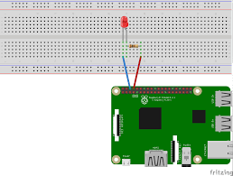
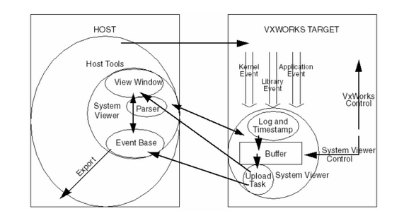
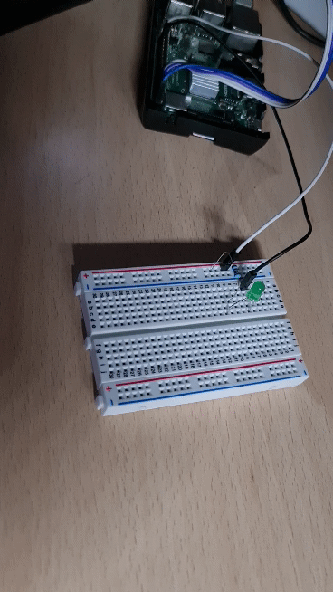

# Blink-LED example for VxWorks on Raspberry 3B+
A simple script to blinking a LED on Raspberry Pi 3B+ with <a href="https://github.com/AngeloDamante/VxWorks_basics">VxWorks</a> RTOS. This project provides the development environment for writing DKM for VxWorks and interact with GPIO bus.

You will need to SD card (>= 8 GB, FAT32), UART cable, Raspberry 3B+ and resistor (220 ohm).
<p align=center>
    
</p>

### Requirements
```bash
- python3
- screen
- pyftpdlib
```

### Preparing
```
git clone https://github.com/AngeloDamante/vxWorks-rb3plus-blink-test.git
cd vxWorks-rb3plus-blink-test
chmod +x init.sh
./init
```

At this point, copy all files from SD_card directory to your partition of SD card. Insert the SD card on Raspberry 3B+ and connect UART cable to PC's USB port.

```
├── vxWorks-rb3plus-blink-test
    ├── SD_card         # For Target
    ├── SDK             # For Host
    └── modules         # dkm files by user
    │   ├── dkm.c
    │   └── ...
    ├── gpioLib         # library to interact to BUS
        ├── gpioLib.h
        └── gpioLib.c

```

## Let's Develop!
<p align=center>
    
</p>

### Host
The gpioLib.h provides the library to interact to GPIO bus. Must build this library to obtain gpioLib.o. The dkm.c is the DKM developed by the user.
```
cd vxWorks-rb3plus-blink-test

# Build modules
source SDK/toolkit/wind_sdk_env.linux
$CC -dkm gpioLib/gpioLib.c modules/dkm.c -o modules/dkm.o

# Start FTP Session
sudo python3 -m pyftpdlib -p 21 -u target -P vxTarget -d modules/ &
```

<b>Tips:</b> if you want dkm in cpp, not mix file.c and file.cpp, a good practice is to have only files in c or cpp.
```
cp gpioLib/gpioLib.c gpioLib.cpp
$CC -dkm gpioLib/gpioLib.cpp modules/dkm.cpp -o modules/dkm.o
```

### Target (Raspberry)
With `lkup "gpio"` commands we can check the absence of gpio related methods in symbols' table before to load the `dkm.o`
```
-> netDevCreate("wrs", "192.168.1.11", 1)
-> cmd
[vxWorks *]# cd wrs
[vxWorks *]# ld "dkm.o"
[vxWorks *]# C
-> sp start 
```

with "192.168.1.11" as example of local HOST IP.

<p align=center>
    
</p>


## Authors
- <a href="https://github.com/AngeloDamante"> Angelo D'Amante </a>
- <a href="https://github.com/KevinMaggi"> Kevin Maggi </a>
